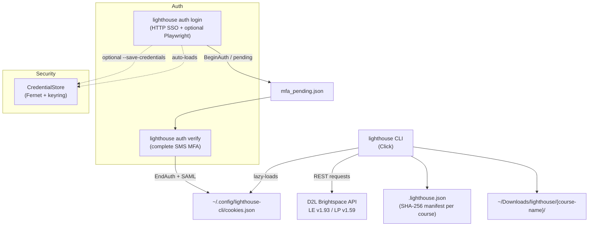

# Lighthouse CLI

CLI tool for interacting with the D2L Brightspace LMS at
[lighthouse.manipal.edu](https://lighthouse.manipal.edu) (Manipal Academy of
Higher Education). Uses the D2L REST API directly — no browser automation,
no Selenium, no headless Chrome needed for data access.

Built so that AI agents (Hermes, Claude Code, etc.) can interact with the
university's LMS through terminal commands, but equally useful for students
who want quick access to their courses from the shell.

## Quick Start

```bash
cd lighthouse-cli
python -m venv .venv && source .venv/bin/activate
pip install -e '.[auth,credentials]'
playwright install chromium   # once — username step on MAHE tenant

# Authenticate (HTTP SSO + SMS MFA)
lighthouse auth login --mfa-method sms
lighthouse auth verify 123456   # code from the SMS/WhatsApp you just received

# Verify the session is alive
lighthouse auth status

# Explore
lighthouse courses
lighthouse content "signals"
lighthouse download "signals" --dry-run
lighthouse grades

# Incremental sync — only download new/changed files
lighthouse sync "signals"

# Assignments
lighthouse assignments "signals"

# Submit a file to a dropbox folder
lighthouse submit -f my_homework.pdf "signals" "Homework 1" --yes
```

> **Auth details:** See [docs/auth-microsoft-sso.md](docs/auth-microsoft-sso.md)
> (hybrid HTTP + Playwright username bootstrap, two-step `login` / `verify` for SMS).
>
> On Arch Linux, use a **venv** — system `pip install` hits PEP 668.

## Architecture



- **Auth (SSO — primary):** Pure-HTTP Microsoft Entra (Azure AD) SSO
  (`ms_auth.py`, split across `ms_parse`/`ms_session`/`ms_mfa`/`ms_errors`),
  with optional Playwright for the username "Next" step only. SMS MFA uses
  `auth login` then `auth verify` so the OTP matches the same `BeginAuth`
  session; offline Authenticator TOTP completes in one step with
  `--mfa-method app --totp <code>`. See
  [docs/auth-microsoft-sso.md](docs/auth-microsoft-sso.md).
- **Auth (CDP — `auth refresh` only):** Session cookies
  (`d2lSecureSessionVal`, `d2lSessionVal`, `d2lSameSiteCanaryA`,
  `d2lSameSiteCanaryB`) can also be extracted from a running browser via
  Chrome DevTools Protocol — through `browser-harness`, Python websockets,
  or a Node.js fallback.
- **API:** D2L REST API — LE v1.93, LP v1.59.
- **Cookie storage:** `~/.config/lighthouse-cli/cookies.json` (permissions
  `0600`). Override with `LIGHTHOUSE_CONFIG_DIR` env var.
- **Download directory:** `~/Downloads/lighthouse/{course-name}/`. Downloads
  create course-name subdirectories. Override with `--output-dir` / `-o`.
- **Manifest files:** `.lighthouse.json` files stored in download directories
  track SHA-256 hashes of previously downloaded files for incremental sync
  and deduplication.
- **Session lifetime:** Cookies expire (typically when the browser session
  ends or D2L rotates them). Re-run `lighthouse auth refresh` or
  `lighthouse auth login` when commands fail with "Session expired".

## Command Reference

Every command accepts `--json` for machine-readable output. All commands
return exit code 0 on success, 1 on error.

---

### `lighthouse auth status`

Check whether the stored session cookies are still valid.

**Flags:** `--json`

**API call:** `GET /d2l/api/versions/` (lightweight ping)

**Human output:**
```
Session valid. Cookies: d2lSameSiteCanaryA, d2lSameSiteCanaryB, d2lSecureSessionVal, d2lSessionVal
```

**JSON output (`--json`):**
```json
{
  "valid": true,
  "cookies": ["d2lSameSiteCanaryA", "d2lSameSiteCanaryB", "d2lSecureSessionVal", "d2lSessionVal"]
}
```

---

### `lighthouse auth login [--user EMAIL] [--pass PASSWORD] [--totp CODE] [--mfa-method auto|sms|app|choose] [--save-credentials] [--json]`

Microsoft SSO login (HTTP + optional Playwright for the username step). For
SMS/WhatsApp, agents should use **`auth verify`** after login sends a code — see
[docs/auth-microsoft-sso.md](docs/auth-microsoft-sso.md). Session cookies
usually expire after ~5 days; re-run login when `auth status` fails.

**Credentials (pick one; do not commit secrets):**

```bash
# Option A: env vars in the current shell only
export LIGHTHOUSE_USERNAME='you@learner.manipal.edu'
export LIGHTHOUSE_PASSWORD='your-password'
lighthouse auth login

# Option B: file (chmod 600), see scripts/credentials.example.env
set -a && source ~/.config/lighthouse-cli/credentials.env && set +a
lighthouse auth login
```

**Flags:**

| Flag | Default | Description |
|------|---------|-------------|
| `--user` | — | Username (email) for Microsoft SSO (or `LIGHTHOUSE_USERNAME` env var) |
| `--pass` | — | Password for Microsoft SSO (or `LIGHTHOUSE_PASSWORD` env var) |
| `--totp` | — | 2FA code. Omit for two-phase interactive prompt |
| `--mfa-method` | `auto` | `auto`, `sms`, `app`, or `choose` (interactive list) |
| `--save-credentials` | — | Save email/password encrypted; cookies still expire ~5 days |
| `--json` | — | Machine-readable output |

**Authentication flow:**

1. GET D2L SAML login → Microsoft
2. Username step (Playwright if `[auth]` installed) → password POST
3. `BeginAuth` sends SMS; may exit and save `mfa_pending.json`
4. `lighthouse auth verify <code>` → EndAuth, ProcessAuth, KMSI, SAML → D2L cookies
5. Saves cookies to `~/.config/lighthouse-cli/cookies.json`
6. Optional `--save-credentials` (Fernet + system keyring)

### `lighthouse auth verify <CODE> [--json]`

Complete MFA using the pending session from `auth login` (same `BeginAuth` —
do not run `login` again before verifying). Required for non-TTY / agent workflows.

**Human output:**
```
Auth login successful. Cookies stored.
```

**JSON output (`--json`):**
```json
{
  "valid": true,
  "cookies": ["d2lSameSiteCanaryA", "d2lSameSiteCanaryB", "d2lSecureSessionVal", "d2lSessionVal"]
}
```

---

### `lighthouse auth refresh [--cdp-port PORT]`

Extract fresh D2L session cookies from the browser and persist them to disk.

**Flags:**

| Flag | Default | Env var | Description |
|------|---------|---------|-------------|
| `--cdp-port` | `34165` | `LIGHTHOUSE_CDP_PORT` | Chrome DevTools Protocol port |

Also accepts `--json`.

**Cookie extraction strategy (in order):**

1. `browser-harness` CLI tool (if installed)
2. Direct CDP via Python `websockets` library
3. Node.js one-liner fallback

**API call:** `GET /d2l/api/versions/` (verification after extraction)

**Human output:**
```
Auth refreshed and verified. Cookies: d2lSameSiteCanaryA, d2lSameSiteCanaryB, d2lSecureSessionVal, d2lSessionVal
```

**JSON output (`--json`):**
```json
{
  "valid": true,
  "cookies": ["d2lSameSiteCanaryA", "d2lSameSiteCanaryB", "d2lSecureSessionVal", "d2lSessionVal"]
}
```

---

### `lighthouse semesters`

List all semesters visible to the authenticated user.

**Flags:** `--json`

**API call:** `GET /d2l/le/manageCourses/api/mysemesters`

**Human output:**
```
Semesters
ID      Name                   Code
------  ---------------------  -----------------
24001   AY 2025-2026 | Sem IV  SEM_IV_2025-2026
24000   AY 2025-2026 | Sem III SEM_III_2025-2026
...
```

**JSON output (`--json`):** Array of semester objects with `OrgUnitId`,
`Name`, `Code`, etc.

---

### `lighthouse courses [--semester FILTER] [--tracked] [--json]`

List courses visible to the authenticated user.

**Flags:**

| Flag | Description |
|------|-------------|
| `-s`, `--semester` | Filter by semester label (requires course tracking config) |
| `--tracked` | Show only tracked courses |
| `--json` | Output raw JSON |

**API call:** `GET /d2l/api/lp/1.47/enrollments/myenrollments/` (full course list)

**Semester filtering** requires course tracking config. Run
`lighthouse config courses` first to select which courses to track and assign
semester labels. Without config, all enrolled courses are shown (unfiltered).

**Human output:**
```
Courses (6)
ID      Name                   Semester    Active
------  ---------------------- ----------- ------
1001    Introduction to CS     Sem IV      Y
1002    Linear Algebra         Sem IV      Y
1003    Physics I                          Y
1004    Technical Writing                  Y
1005    Digital Logic                      Y
1006    Probability & Statistics           Y
```

**JSON output (`--json`):** Array of course objects with `OrgUnitId`, `Name`,
`Code`, `IsActive`, `semester`, etc.

---

### `lighthouse config courses [OPTIONS]`

Manage course tracking and semester mapping.

**Why tracking?** Because the learner role cannot access the D2L orgstructure
API (returns 403), there's no reliable way to automatically map courses to
semesters. Instead, you explicitly choose which courses to track and optionally
assign semester labels. These labels are then used by `--semester` filtering
in `courses`, `download`, and `sync`.

**Config file:** `~/.config/lighthouse-cli/course-config.json`

**Interactive setup (no flags):**

```
$ lighthouse config courses

Available courses (from API):
ID    Name                    Code                    Tracked
44347 Signals & Systems       009_BME2125_2025-2026
36060 PSUC                    PSUC_2024-2025
44348 Eng Math III            009_MAT2223_2025-2026

Select courses to track (comma-separated IDs, or 'all'): 44347,44348
  Semester for Signals & Systems (44347): Sem IV
  Semester for Eng Math III (44348): Sem III

Updated tracking config: 2 course(s) updated.
```

**Flags:**

| Flag | Description |
|------|-------------|
| `--add ID` | Track a course by ID or name |
| `--remove ID` | Stop tracking a course by ID |
| `-s`, `--semester` | Semester label to assign (used with `--add`) |
| `--list` | Show currently tracked courses |
| `--reset` | Clear all course tracking config |
| `--json` | Output tracked courses as JSON |

**Examples:**

```bash
# Interactive setup
lighthouse config courses

# Track a single course with semester label
lighthouse config courses --add 44347 --semester "Sem IV"

# Track a course by name, assign later
lighthouse config courses --add "signals"

# List tracked courses
lighthouse config courses --list

# Remove a course from tracking
lighthouse config courses --remove 44347

# Clear everything
lighthouse config courses --reset
```

---

### `lighthouse content COURSE_ID [--json]`

Show the content tree (modules > submodules > topics) for a course.

**Arguments:**

| Argument | Description |
|----------|-------------|
| `COURSE_ID` | Numeric OrgUnitId (e.g. `1001`) **or** name substring (e.g. `signals`) |

**Flags:** `--json`

**API call:** `GET /d2l/api/le/1.93/{orgId}/content/toc`

When using a name substring, the tool fetches the course list and matches
case-insensitively. Ambiguous matches print all candidates and exit with
code 1.

**Human output:**
```
📁 Unit 1 - Introduction
  📄 L1-L2 Introduction to computing.pdf  [id:2345]
  📄 L3 Signal Classification.pdf          [id:2346]
📁 Unit 2 - Systems
  📄 L4 LTI Systems.pdf                   [id:2347]
  🔗 Reference Material                   [id:2348]
```

Icons: `📁` module, `📄` file, `🔗` link, `📎` other.

**JSON output (`--json`):** Full nested TOC object as returned by the API
with `Modules` containing sub-`Modules` and `Topics`.

---

### `lighthouse download COURSE_ID [TOPIC_ID] [-o DIR] [--dry-run] [--include-assignments] [--types TYPES] [--json]`

Download files from a course.

**Arguments:**

| Argument | Required | Description |
|----------|----------|-------------|
| `COURSE_ID` | Yes | Numeric OrgUnitId or name substring |
| `TOPIC_ID` | No | Specific topic to download. If omitted, downloads all files |

**Flags:**

| Flag | Description |
|------|-------------|
| `-o`, `--output-dir` | Custom download directory (default: `~/Downloads/lighthouse/{course-name}/`) |
| `--dry-run` | List files that would be downloaded without actually downloading |
| `--include-assignments` | Also download assignment attachments from dropbox folders |
| `--types` | Filter by file type (comma-separated, e.g. `--types pdf,docx`) |
| `--json` | Output structured JSON (download plan or result) |

**API calls:**
- `GET /d2l/api/le/1.93/{orgId}/content/toc` (to enumerate topics)
- `GET /d2l/api/le/1.93/{orgId}/content/topics/{topicId}/file` (per file)
- `GET /d2l/api/le/1.93/{orgId}/dropbox/folders/` (when `--include-assignments`)
- `GET /d2l/api/le/1.93/{orgId}/dropbox/folders/{folderId}/attachments/{fileId}` (assignment attachments)

Downloads preserve the module path structure from the content tree. Only
topics with `TypeIdentifier == "File"` are downloaded (links are skipped).
Downloads create course-name subdirectories (e.g.
`~/Downloads/lighthouse/Introduction to CS/` instead of
`~/Downloads/lighthouse/1001/`).

**Human output (single file):**
```
Downloaded: ~/Downloads/lighthouse/Introduction to CS/Unit 1/L1-L2 Introduction.pdf (245.3 KB)
```

**Human output (all files, `--dry-run`):**
```
Would download 12 files to ~/Downloads/lighthouse/Introduction to CS/

  [2345] L1-L2 Introduction to computing.pdf
  [2346] L3 Signal Classification.pdf
  [2347] L4 LTI Systems.pdf
  ...
```

**JSON output (`--json`, `--dry-run`):**
```json
[
  {"topic_id": 2345, "title": "L1-L2 Introduction to computing.pdf", "path": "Unit 1/L1-L2 Introduction to computing.pdf"},
  ...
]
```

**JSON output (`--json`, single file download):**
```json
{
  "path": "/home/user/Downloads/lighthouse/Introduction to CS/L1-L2 Introduction.pdf",
  "size_kb": 245.3,
  "filename": "L1-L2 Introduction.pdf"
}
```

---

### `lighthouse sync COURSE_ID [TOPIC_ID] [-o DIR] [--semester FILTER] [--also COURSE] [--force] [--json]`

Incremental sync command that downloads only new or changed files using
manifest-based tracking with SHA-256 dedup.

**Arguments:**

| Argument | Required | Description |
|----------|----------|-------------|
| `COURSE_ID` | Yes | Numeric OrgUnitId or name substring |
| `TOPIC_ID` | No | Specific topic to sync. If omitted, syncs all files |

**Flags:**

| Flag | Description |
|------|-------------|
| `-o`, `--output-dir` | Custom download directory (default: `~/Downloads/lighthouse/{course-name}/`) |
| `--semester` | Resolve to latest semester and sync all its courses |
| `--also` | Additional courses to sync (can be specified multiple times) |
| `--force` | Force re-download of all files, ignoring manifest |
| `--json` | Output structured JSON result |

**How it works:**

1. Loads the manifest file (`.lighthouse.json`) from the download directory
2. Fetches the current content tree from the API
3. Computes SHA-256 hashes for each file in the tree
4. Compares against manifest — only downloads files that are new or have
   changed hashes
5. Updates the manifest with current file hashes
6. Reports orphaned topics (files in manifest but no longer in content tree)

**Manifest files:** Stored as `.lighthouse.json` in the download directory.
Contains a mapping of topic IDs to their SHA-256 hashes:

```json
{
  "1234": {
    "sha256": "a1b2c3d4...",
    "filename": "L1-L2 Introduction.pdf",
    "size": 250880,
    "downloaded_at": "2025-05-10T14:30:00Z",
    "last_modified": "2025-05-09T08:00:00Z"
  }
}
```

**Multi-course scope:**
- `--semester` resolves to the latest semester and syncs all its courses
- `--also` adds additional courses (by ID or name) to the sync scope
- Each course gets its own subdirectory and manifest file

**Human output:**
```
Syncing Introduction to CS...
  New:      3 files
  Updated:  1 file
  Unchanged: 8 files
  Orphaned:  2 topics (files no longer in content tree)
  Downloaded: 4.2 MB
```

**JSON output (`--json`):**
```json
{
  "course_id": 1001,
  "new": 3,
  "updated": 1,
  "unchanged": 8,
  "orphaned": 2,
  "downloaded_bytes": 4404019,
  "files": [
    {"path": "Unit 2/New Notes.pdf", "status": "new", "size_kb": 312.5},
    {"path": "Unit 1/Updated Slides.pdf", "status": "updated", "size_kb": 156.8}
  ]
}
```

---

### `lighthouse assignments COURSE_ID [--json]`

List assignments (dropbox folders) for a course.

**Arguments:**

| Argument | Description |
|----------|-------------|
| `COURSE_ID` | Numeric OrgUnitId or name substring |

**Flags:** `--json`

**API call:** `GET /d2l/api/le/1.93/{orgId}/dropbox/folders/` (handles
pagination automatically)

**Human output:**
```
Assignments – Introduction to CS
ID    Name                          Due Date            Status
----  ----------------------------  ------------------  --------
101   Homework 1                    2025-05-15 23:59    Open
102   Lab Report 2                  2025-05-20 23:59    Open
103   Final Project                 2025-06-01 23:59    Closed
```

**JSON output (`--json`):**
```json
{
  "course_id": 1001,
  "assignments": [
    {
      "Id": 101,
      "Name": "Homework 1",
      "DueDate": "2025-05-15T23:59:00Z",
      "Availability": {
        "StartDate": null,
        "EndDate": "2025-05-15T23:59:00Z",
        "IsAvailable": true
      }
    }
  ]
}
```

---

### `lighthouse grades [COURSE_ID] [--json]`

Show grades. If `COURSE_ID` is omitted, shows grades for all courses.

**Arguments:**

| Argument | Required | Description |
|----------|----------|-------------|
| `COURSE_ID` | No | Numeric OrgUnitId or name substring |

**Flags:** `--json`

**API calls:**
- `GET /d2l/api/le/1.93/{orgId}/grades/` — grade schema (names, weights, max points)
- `GET /d2l/api/le/1.93/{orgId}/grades/values/myGradeValues/` — actual grade values

Merges the two responses using `GradeObjectIdentifier` (string) from the
values API matched against `Id` from the schema API. Shows
`PointsNumerator/PointsDenominator` when available.

**Human output:**
```
Grades – Technical Writing
Item                    Grade    Weight  Type
----------------------  -------  ------  --------
CAT 1                   18/20    15%     Points
Assignment 1            9/10     10%     Points
Midterm                 –/50     25%     Points
```

**JSON output (`--json`):**
```json
{
  "course_id": 1004,
  "grades": [
    {"name": "CAT 1", "grade": "18/20", "weight": "15%", "type": "Points"},
    {"name": "Assignment 1", "grade": "9/10", "weight": "10%", "type": "Points"},
    {"name": "Midterm", "grade": "–/50", "weight": "25%", "type": "Points"}
  ]
}
```

---

### `lighthouse submit -f FILE COURSE_ID FOLDER_ID [--yes] [--json]`

Submit a file to a D2L dropbox folder.

**Arguments:**

| Argument | Required | Description |
|----------|----------|-------------|
| `FILE` | Yes | Path to the file to submit (via `-f` / `--file`) |
| `COURSE_ID` | Yes | Numeric OrgUnitId or name substring |
| `FOLDER_ID` | Yes | Numeric folder ID or name substring |

**Flags:**

| Flag | Description |
|------|-------------|
| `-f`, `--file` | Path to the file to submit (required) |
| `--yes` | Skip confirmation prompt (also auto-skipped in non-TTY) |
| `--json` | Output structured JSON result |

**API call:** `POST /d2l/api/le/1.93/{orgId}/dropbox/folders/{folderId}/submissions/mysubmissions/`
(multipart/mixed body)

**Resolution:**
- `COURSE_ID`: numeric OrgUnitId or case-insensitive name substring match
- `FOLDER_ID`: numeric folder ID or case-insensitive name substring match
  against assignment names

**Confirmation:** Prompts for confirmation before submitting. Skipped with
`--yes` or when running in a non-TTY environment (e.g. from an agent).

**Error handling:**
- Session expired → prints message to stderr, exit code 1
- Permission denied → folder not accessible, exit code 1
- Folder not found → lists available folders, exit code 1
- Server error → reports HTTP status, exit code 1

**Human output:**
```
Submit homework.pdf to "Homework 1" in Introduction to CS? [y/N]: y
Submitted successfully. Submission ID: 5001
```

**JSON output (`--json`):**
```json
{
  "submission_id": 5001,
  "folder_id": 101,
  "course_id": 1001,
  "file": "homework.pdf",
  "submitted_at": "2025-05-10T15:30:00Z"
}
```

---

### `lighthouse announcements [COURSE_ID] [--json]`

Show announcements. If `COURSE_ID` is omitted, shows announcements for all
courses (courses with no announcements are skipped silently).

**Arguments:**

| Argument | Required | Description |
|----------|----------|-------------|
| `COURSE_ID` | No | Numeric OrgUnitId or name substring |

**Flags:** `--json`

**API call:** `GET /d2l/api/le/1.93/{orgId}/news/`

**Human output:**
```
📢 Introduction to CS
  [2025-05-08 14:30] Midterm schedule update
    The midterm examination has been rescheduled...
    📎 updated_schedule.pdf (156 KB)
```

**JSON output (`--json`):**
```json
{
  "course_id": 1001,
  "announcements": [
    {
      "Id": 9999,
      "Title": "Midterm schedule update",
      "Body": {"Text": "...", "Html": "..."},
      "CreatedDate": "2025-05-08T14:30:00Z",
      "Attachments": [...]
    }
  ]
}
```

---

### `lighthouse calendar [COURSE_ID] [--json]`

Show calendar events. If `COURSE_ID` is omitted, shows events for all courses.

**Arguments:**

| Argument | Required | Description |
|----------|----------|-------------|
| `COURSE_ID` | No | Numeric OrgUnitId or name substring |

**Flags:** `--json`

**API call:** `GET /d2l/api/le/1.93/{orgId}/calendar/events/`

**Human output:**
```
Calendar – Introduction to CS
Date              Title                        Course
----------------  ---------------------------- ----------------------
2025-05-15 10:00  Midterm Examination           Introduction to CS
2025-05-20 23:59  Assignment 3 Deadline         Introduction to CS
```

**JSON output (`--json`):**
```json
{
  "course_id": 1001,
  "events": [
    {
      "CalendarEventId": "...",
      "Title": "Midterm Examination",
      "StartDateTime": "2025-05-15T10:00:00Z",
      "EndDateTime": "2025-05-15T12:00:00Z",
      "OrgUnitName": "Introduction to CS"
    }
  ]
}
```

---

### `lighthouse quizzes [COURSE_ID] [--json]`

Show quizzes. If `COURSE_ID` is omitted, shows quizzes for all courses.

**Arguments:**

| Argument | Required | Description |
|----------|----------|-------------|
| `COURSE_ID` | No | Numeric OrgUnitId or name substring |

**Flags:** `--json`

**API call:** `GET /d2l/api/le/1.93/{orgId}/quizzes/` (handles pagination
automatically — follows `Next` links until exhausted)

**Human output:**
```
Quizzes – Introduction to CS
ID    Name                          Start               End
----  ----------------------------  ------------------  ------------------
201   Quiz 1 - Basics              2025-05-10 10:00    2025-05-10 10:30
202   Quiz 2 - Advanced Topics     2025-05-17 10:00    2025-05-17 10:30
```

**JSON output (`--json`):**
```json
{
  "course_id": 1001,
  "quizzes": [
    {
      "QuizId": 201,
      "Name": "Quiz 1 - Basics",
      "StartDate": "2025-05-10T10:00:00Z",
      "EndDate": "2025-05-10T10:30:00Z"
    }
  ]
}
```

---

### `lighthouse quiz COURSE_ID QUIZ_ID [--json]`

Show detailed info for a specific quiz (settings, time limits, attempt rules, dates).

**Arguments:**

| Argument | Required | Description |
|----------|----------|-------------|
| `COURSE_ID` | Yes | Numeric OrgUnitId or name substring |
| `QUIZ_ID` | Yes | Numeric quiz ID |

**Flags:** `--json`

**API call:** `GET /d2l/api/le/1.93/{orgId}/quizzes/{quizId}`

Note: quiz questions and past attempts return 403 for learner role. Only quiz metadata is accessible via the API.

## API Endpoints

All endpoints are relative to `https://lighthouse.manipal.edu`.

| Feature | Method | Endpoint | Notes |
|---------|--------|----------|-------|
| API versions | GET | `/d2l/api/versions/` | Used for auth verification |
| Semesters | GET | `/d2l/le/manageCourses/api/mysemesters` | |
| Departments | GET | `/d2l/le/manageCourses/api/mydepartments` | |
| Roles | GET | `/d2l/le/manageCourses/api/myroles` | |
| Courses (enrollments) | GET | `/d2l/api/lp/1.47/enrollments/myenrollments/` | Full course list (paginated) |
| Content TOC | GET | `/d2l/api/le/1.93/{orgId}/content/toc` | Nested Modules/Topics |
| Topic details | GET | `/d2l/api/le/1.93/{orgId}/content/topics/{topicId}` | Returns topic details including HTML content |
| File download | GET | `/d2l/api/le/1.93/{orgId}/content/topics/{topicId}/file` | Binary response with `Content-Disposition` |
| Dropbox folders | GET | `/d2l/api/le/1.93/{orgId}/dropbox/folders/` | Paginated, returns assignment/dropbox info |
| Download attachment | GET | `/d2l/api/le/1.93/{orgId}/dropbox/folders/{folderId}/attachments/{fileId}` | Binary download |
| Submit file | POST | `/d2l/api/le/1.93/{orgId}/dropbox/folders/{folderId}/submissions/mysubmissions/` | Multipart/mixed body |
| Announcements | GET | `/d2l/api/le/1.93/{orgId}/news/` | |
| Grade schema | GET | `/d2l/api/le/1.93/{orgId}/grades/` | Grade objects with name, weight, max points |
| My grades | GET | `/d2l/api/le/1.93/{orgId}/grades/values/myGradeValues/` | Returns `GradeObjectIdentifier` (string) |
| Quizzes | GET | `/d2l/api/le/1.93/{orgId}/quizzes/` | Paginated: `{Objects: [...], Next: url\|null}` |
| Calendar | GET | `/d2l/api/le/1.93/{orgId}/calendar/events/` | |

## Gotchas & Notes

- **Cookie expiration:** Cookies expire. When they do, every command will
  print `Session expired. Run: lighthouse auth refresh` to stderr and exit
  with code 1. Use `auth login` for headless browser-based re-authentication.
- **GradeObjectIdentifier vs GradeObjectId:** The `myGradeValues` API returns
  `GradeObjectIdentifier` (a string), not `GradeObjectId` (an int). The merge
  logic in `cmd_grades` handles this by trying both field names.
- **Semester filtering requires course tracking config:** Because the learner
  role gets 403 on the D2L orgstructure API, there's no automatic way to map
  courses to semesters. Run `lighthouse config courses` to set up tracking
  and semester labels. Without config, `--semester` flags will prompt you to
  set it up, and `download`/`sync` will include all courses.
- **URL-encoded filenames in downloads:** The `Content-Disposition` header
  from the file-download API contains URL-encoded filenames
  (e.g. `%20` for spaces). The `_sanitize_filename` helper URL-decodes them.
- **Quiz API pagination:** The quiz endpoint returns
  `{Objects: [...], Next: "<url>" | null}`. `LighthouseClient.get_quizzes()`
  follows all `Next` links automatically.
- **Course ID resolution:** When you pass a non-numeric string as
  `COURSE_ID`, it performs case-insensitive substring matching against course
  names. If exactly one match, it proceeds. If ambiguous, it lists all
  matches and exits with code 1.
- **Manifest corruption:** If a `.lighthouse.json` file becomes corrupted, the
  sync command will warn and treat all files as new. Delete the manifest to
  force a full re-sync.
- **Orphaned topics:** Files that appear in the manifest but are no longer in
  the content tree are reported as "orphaned". They are not deleted
  automatically — the user must clean them up manually.
- **Credential storage:** `CredentialStore` uses Fernet symmetric encryption
  for credential storage with OS keyring as a fallback. If neither is
  available, credentials are stored in plaintext (with a warning).
- **Headless auth timeout:** The `auth login` command has a default 120-second
  timeout to account for 2FA. If authentication takes longer, use
  `--timeout` to increase it.

## For AI Agents

This CLI was built specifically so AI agents can interact with the LMS
programmatically. Here's the recommended workflow:

```
1. Check auth
   $ lighthouse auth status
   -> {valid: true, cookies: [...]}

2. If expired, refresh (requires browser running with CDP)
   $ lighthouse auth refresh --cdp-port 34165
   -> {valid: true, cookies: [...]}

   OR use headless browser auth (no pre-running browser needed)
   $ lighthouse auth login
   -> {valid: true, cookies: [...]}

3. Always use --json for structured output
   $ lighthouse courses --json
   $ lighthouse content "signals" --json
   $ lighthouse grades --json

4. Course IDs can be numeric or fuzzy name substrings
   $ lighthouse content "signals" --json
   # resolves "signals" -> OrgUnitId (from courses API)

5. Preview downloads before committing
   $ lighthouse download "signals" --dry-run --json
   # returns [{topic_id, title, path}, ...]

6. Download specific files
   $ lighthouse download "signals" 2345 --json
   # returns {path, size_kb, filename}

7. Download all files from a course
   $ lighthouse download "signals"
   # saves to ~/Downloads/lighthouse/{course-name}/

8. Download including assignment attachments
   $ lighthouse download "signals" --include-assignments --json

9. Filter downloads by file type
   $ lighthouse download "signals" --types pdf,docx --json

10. Incremental sync — only download new/changed files
    $ lighthouse sync "signals" --json
    # returns {new, updated, unchanged, orphaned, downloaded_bytes}

11. Sync multiple courses at once
    $ lighthouse sync "signals" --also "math" --also "physics" --json

12. Check assignments for a course
    $ lighthouse assignments "signals" --json
    # returns [{Id, Name, DueDate, Availability}, ...]

13. Submit a file to a dropbox folder
    $ lighthouse submit -f homework.pdf "signals" "Homework 1" --yes --json
    # returns {submission_id, folder_id, course_id, file, submitted_at}

14. Resolve folder ID by name
    $ lighthouse submit -f report.pdf "signals" "Lab Report" --yes --json
    # resolves "Lab Report" -> folder ID
```

**Tips for agents:**
- All commands exit with code 0 on success, 1 on failure. Check the exit
  code.
- Error messages go to stderr; normal output goes to stdout.
- `--json` output is stable and machine-parseable.
- When in doubt about a course ID, run `lighthouse courses --json` and
  filter locally.
- The `content` command's JSON output contains the full nested module tree
  with `TopicId` values needed for targeted downloads.
- Manifest files (`.lighthouse.json`) enable deduplication: re-running sync
  skips unchanged files and only downloads new/modified ones.
- Orphaned topics in sync output indicate files that were removed from the
  LMS content tree but still exist locally.
- The `submit` command auto-skips confirmation in non-TTY mode, so agents
  don't need `--yes`. But include it anyway for safety.
- Use `assignments --json` to discover folder IDs before submitting.
- Course and folder resolution both support name substrings, so you don't
  need to memorize numeric IDs.

## Project Structure

```
lighthouse-cli/
  pyproject.toml           Package config, dependencies (click, requests, rich,
                           playwright, cryptography, keyring, requests-toolbelt)
  README.md                This file
  lighthouse_cli/
    __init__.py            Version string (__version__ = "0.1.0")
    api.py                 LighthouseClient — HTTP client, auth, cookie
                           management, all API methods, course ID resolution,
                           CDP-based cookie extraction (used by auth refresh)
    auth.py                cmd_auth_login / cmd_auth_verify orchestration;
                           CredentialStore — Fernet encryption with keyring
                           fallback for secure credential storage
    ms_auth.py             MicrosoftSSOClient — pure-HTTP Microsoft Entra (Azure
                           AD) SSO (SAML + ConvergedTFA MFA); username bootstrap
                           via optional Playwright
    ms_parse.py            $Config / HTML / SAML extraction helpers
    ms_session.py          cookie & session helpers (export/import, phone mask)
    ms_mfa.py              MFA proof types + selection (SMS vs app TOTP)
    ms_errors.py           MicrosoftSSOError + MFA method constants
    commands.py            Command implementations — data fetching, formatting,
                           output (rich tables + plain text fallback + JSON)
    cli.py                 Click command wiring — CLI entry point, arguments
    config.py              cookies.json / mfa_pending.json storage helpers
    show.py, display.py    shared table/JSON rendering helpers
    submit.py              dropbox file-submission command
    assignments.py         assignment listing + attachment download
    course_config.py       course tracking + semester mapping
    manifest.py            Manifest class — load/save manifest files, add_entry,
                           atomic writes, SHA-256 file hashing for incremental
                           sync and deduplication
    utils.py               Shared utilities — _sanitize_filename() and helpers
```

**Key classes and functions:**

- `LighthouseClient` (api.py) — Stateful HTTP client wrapping
  `requests.Session` with D2L auth cookies. Lazy-loads cookies from disk on
  first request. All API methods live here.
- `resolve_course_id()` (api.py) — Resolves a string identifier (numeric
  OrgUnitId or name substring) to an integer course ID.
- `refresh_auth_from_browser()` (api.py) — Extracts cookies from browser via
  CDP (tries browser-harness, then websockets, then Node.js).
- `MicrosoftSSOClient` (ms_auth.py) — pure-HTTP Microsoft Entra (Azure AD) SSO:
  replays the `$Config` / SAS-MFA / SAML ACS endpoints, handles two-step SMS
  MFA and offline Authenticator TOTP, and returns D2L session cookies.
  Playwright is used only to bootstrap the username "Next" step.
- `CredentialStore` (auth.py) — Secure credential storage using Fernet
  symmetric encryption with OS keyring fallback.
- `Manifest` (manifest.py) — Manages `.lighthouse.json` files in download
  directories. Tracks file paths with SHA-256 hashes. Supports atomic writes
  to prevent corruption.
- `_sanitize_filename()` (utils.py) — URL-decodes and sanitizes filenames
  from Content-Disposition headers.
- `cmd_*` functions (commands.py) — One per CLI command. Return exit code
  (0 or 1). Handle `--json` output mode internally.
- `_walk_content_tree()` / `_flatten_all_topics()` (commands.py) — Recursively
  process the nested content TOC for display and download.

**Dependencies:**

| Package | Purpose |
|---------|---------|
| `click>=8.1` | CLI framework (commands, options, arguments) |
| `requests>=2.31` | HTTP client for D2L REST API |
| `rich>=13.0` | Pretty terminal tables (graceful fallback to plain text) |
| `playwright>=1.40` | Headless browser for auth login |
| `cryptography>=41.0` | Fernet encryption for credential storage |
| `keyring>=24.0` | OS keyring integration for credential storage |
| `requests-toolbelt>=1.0` | Multipart encoding for file submission |

**Optional dependencies (for CDP cookie extraction):**

| Package | Purpose |
|---------|---------|
| `browser-harness` | CLI tool for CDP cookie extraction |
| `websockets` | Python CDP client fallback |
| Node.js | Final fallback for CDP cookie extraction |

**Dev dependencies:**

| Package | Purpose |
|---------|---------|
| `pytest>=7.0` | Testing framework |
| `pytest-mock>=3.12` | Mocking utilities |

## Environment Variables

| Variable | Default | Description |
|----------|---------|-------------|
| `LIGHTHOUSE_CONFIG_DIR` | `~/.config/lighthouse-cli` | Directory for cookie storage |
| `LIGHTHOUSE_CDP_PORT` | `34165` | Default CDP port for `auth refresh` |

## Contributing & AI Code Review

Contributor and agent conventions live in [`AGENTS.md`](AGENTS.md); the
PR-review charter (what reviewers check, by severity) lives in
[`review.md`](review.md). Run `pytest -q` before opening a PR.

This repo is wired for several AI reviewers. Each reads its own committed
config; all derive from `review.md`:

| Reviewer | Config file(s) |
|----------|----------------|
| OpenAI Codex / Google Jules | [`AGENTS.md`](AGENTS.md) |
| Gemini Code Assist | [`.gemini/config.yaml`](.gemini/config.yaml), [`.gemini/styleguide.md`](.gemini/styleguide.md) |
| CodeRabbit | [`.coderabbit.yaml`](.coderabbit.yaml) |
| Qodo Merge | [`.pr_agent.toml`](.pr_agent.toml), [`best_practices.md`](best_practices.md) |
| Socket Security | [`socket.yml`](socket.yml) |
| Kilo Code, Pullfrog | dashboard-only — paste [`review.md`](review.md) into their consoles |

## License

MIT
