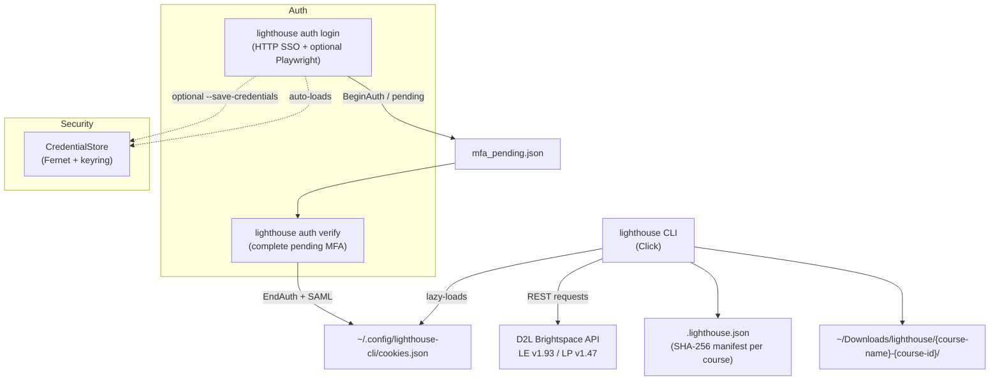

# Lighthouse CLI

CLI tool for interacting with the D2L Brightspace LMS at
[lighthouse.manipal.edu](https://lighthouse.manipal.edu) (Manipal Academy of
Higher Education). Uses the D2L REST API directly — no browser automation,
no Selenium, no headless Chrome needed for data access.

Built so that AI agents (Hermes, Claude Code, etc.) can interact with the
university's LMS through terminal commands, but equally useful for students
who want quick access to their courses from the shell.

## Quick Start

```bash
cd lighthouse-cli
python -m venv .venv && source .venv/bin/activate
pip install -e '.[auth,credentials]'
playwright install chromium   # once — username step on MAHE tenant

# Authenticate in one interactive command
lighthouse auth login
# Enter email/password, choose a registered 2FA method, then enter/approve it.

# Verify the session is alive
lighthouse auth status

# Explore
lighthouse courses
lighthouse content "signals"
lighthouse download "signals" --dry-run
lighthouse grades

# Incremental sync — only download new/changed files
lighthouse sync "signals"

# Assignments
lighthouse assignments "signals"

# Submit a file to a dropbox folder
lighthouse submit -f my_homework.pdf "signals" "Homework 1" --yes
```

> **Auth details:** See [docs/auth-microsoft-sso.md](docs/auth-microsoft-sso.md)
> (hybrid HTTP + Playwright username bootstrap, plus non-interactive recovery).
>
> On Arch Linux, use a **venv** — system `pip install` hits PEP 668.

## Architecture


```mermaid
graph TD
    subgraph Auth
        A1["lighthouse auth login<br/>(HTTP SSO + optional Playwright)"]
        A2["lighthouse auth verify<br/>(complete pending MFA)"]
    end
    A1 -->|BeginAuth / pending| PENDING["mfa_pending.json"]
    A2 -->|EndAuth + SAML| COOKIES["~/.config/lighthouse-cli/cookies.json"]
    PENDING --> A2

    CLI["lighthouse CLI<br/>(Click)"] -->|lazy-loads| COOKIES
    CLI -->|REST requests| API["D2L Brightspace API<br/>LE v1.93 / LP v1.47"]

    CLI --> MANIFEST[".lighthouse.json<br/>(SHA-256 manifest per course)"]
    CLI --> DOWNLOADS["~/Downloads/lighthouse/{course-name}-{course-id}/"]

    subgraph Security
        CRED["CredentialStore<br/>(Fernet + keyring)"]
    end
    A1 -.->|optional --save-credentials| CRED
    A1 -.->|auto-loads| CRED
```

- **Auth (SSO — primary):** Pure-HTTP Microsoft Entra (Azure AD) SSO
  (`ms_auth.py`, split across `ms_parse`/`ms_session`/`ms_mfa`/`ms_errors`),
  with optional Playwright for the username "Next" step only (falls back to
  the mirrored HTTP sequence when the browser cannot launch). A plain
  interactive `auth login` fetches the account's registered verification
  methods, lets the user choose, and completes the code or approval in one
  process. Non-interactive SMS, voice, and push flows save a resumable challenge
  for `auth verify <code|ok>`. Offline Authenticator TOTP can also be supplied
  with `--mfa-method app --totp <code>`. `auth mfa-methods` lists what the
  account supports without starting a challenge.
  See [docs/auth-microsoft-sso.md](docs/auth-microsoft-sso.md).
- **Auth (CDP — `auth refresh` only):** Session cookies
  (`d2lSecureSessionVal`, `d2lSessionVal`, `d2lSameSiteCanaryA`,
  `d2lSameSiteCanaryB`) can also be extracted from a running browser via
  Chrome DevTools Protocol through `browser-harness` or Python websockets.
- **API:** D2L REST API — LE v1.93, LP v1.47.
- **Secret storage:** All session secrets are encrypted at rest by
  `CredentialStore` (Fernet): `cookies.json`, `mfa_pending.json`, and
  `credentials.json` in `~/.config/lighthouse-cli/` (permissions `0600`;
  override the directory with `LIGHTHOUSE_CONFIG_DIR`). Only non-secret
  metadata (timestamps, MFA method) is stored unencrypted beside the
  ciphertext. See "Encryption key sources" below.
- **Download directory:** `~/Downloads/lighthouse/{course-name}-{course-id}/`.
  Downloads create sanitized course-name subdirectories with the OrgUnitId
  suffix. Override the root with `--output-dir` / `-o`.
- **Manifest files:** `.lighthouse.json` files stored in download directories
  track SHA-256 hashes of previously downloaded files for incremental sync
  and deduplication.
- **Session lifetime:** Cookies expire (typically when the browser session
  ends or D2L rotates them). Re-run `lighthouse auth refresh` or
  `lighthouse auth login` when commands fail with "Session expired".

## Command Reference

`--json` is a leaf-command option, not a global flag. Use it only on the
commands whose reference below lists it. For a leaf command invoked with
`--json`, stdout contains exactly one JSON document on success or failure;
Click/runtime diagnostics, prompts, warnings, and errors are written to
stderr. `--help` remains human-readable.

### Safety at a glance

- **[READ-ONLY]:** `semesters`, `courses`, `content`, `grades`, `announcements`,
  `calendar`, `quizzes`, `quiz`, and `assignments` only read LMS data.
- **[LOCAL WRITE]:** `auth` stores local session state, `config courses` writes
  `course-config.json`, and `download`/`sync` write files and manifests under
  the local download root (`--output-dir`, default `~/Downloads/lighthouse`).
- **[REMOTE WRITE]:** `submit` sends a file to Brightspace. It is the only
  command in this list that mutates remote LMS state and requires confirmation
  unless `--yes` is supplied.

`--dry-run` is available on `download` only and writes nothing: it does not
create or replace a manifest, create directories, or download file bodies.

---

### `lighthouse auth status`

Check whether the stored session cookies are still valid.

**Flags:** `--json`

**API call:** `GET /d2l/api/versions/` (lightweight ping)

**Human output:**
```
Session valid. Cookies: d2lSameSiteCanaryA, d2lSameSiteCanaryB, d2lSecureSessionVal, d2lSessionVal
```

**JSON output (`--json`):**
```json
{
  "valid": true,
  "cookies": ["d2lSameSiteCanaryA", "d2lSameSiteCanaryB", "d2lSecureSessionVal", "d2lSessionVal"]
}
```

---

### `lighthouse auth login [--user EMAIL] [--totp CODE] [--mfa-method auto|sms|app|call|push|choose] [--save-credentials] [--json]`

Microsoft SSO login (HTTP + optional Playwright for the username step). In a
terminal, run `lighthouse auth login`: enter email/password, choose one of the
methods Microsoft reports for the account, then enter the fresh code or approve
the request. The command saves and verifies the session, then shows useful next
commands. Non-interactive runs use `auth verify <code|ok>` to resume the same
saved challenge. See [docs/auth-microsoft-sso.md](docs/auth-microsoft-sso.md).
Session cookies usually expire after ~5 days; re-run login when `auth status` fails.

**Credentials (pick one; do not commit secrets):**

```bash
# Option A: env vars in the current shell only
export LIGHTHOUSE_USERNAME='you@learner.manipal.edu'
export LIGHTHOUSE_PASSWORD='your-password'
lighthouse auth login

# Option B: file (chmod 600), see scripts/credentials.example.env
set -a && source ~/.config/lighthouse-cli/credentials.env && set +a
lighthouse auth login
```

**Flags:**

| Flag | Default | Description |
|------|---------|-------------|
| `--user` | — | Username (email) for Microsoft SSO (or `LIGHTHOUSE_USERNAME` env var) |
| `--totp` | — | Offline `PhoneAppOTP` code, or `-` to read a fresh SMS code after BeginAuth; rejected for voice/push |
| `--mfa-method` | `choose` in an interactive terminal; `auto` otherwise | `auto`, `sms`, `app`, `call` (voice), `push` (approve), or `choose` (account method list) |
| `--save-credentials` | — | Save email/password encrypted; cookies still expire ~5 days |
| `--json` | — | Machine-readable output |

**Authentication flow:**

1. GET D2L SAML login → Microsoft
2. Username step (Playwright if `[auth]` installed) → password POST
3. Session-pull interstitial hop (re-POST echoed params, bounded — Aug 2026 upstream change)
4. Microsoft returns the account's registered methods; interactive login lets the user choose
5. `BeginAuth` sends the text code or starts a voice/push approval
6. Interactive login completes EndAuth inline; non-interactive login saves `mfa_pending.json` for `auth verify <code|ok>`
7. Saves and verifies cookies in `~/.config/lighthouse-cli/cookies.json` (encrypted)
8. Optional `--save-credentials` stores email/password (encrypted via CredentialStore)

**Encryption key sources** (checked in order; a usable source is required
before any login side effect):

1. `LIGHTHOUSE_SECRETS_PASSPHRASE` env var — recommended for headless/cron
   use. The passphrase is stretched (PBKDF2) with a per-artifact salt stored
   beside the ciphertext.
2. System keyring (`keyring` package), reusing the existing
   `("lighthouse-cli", "credential-key")` entry.
3. Neither → auth commands fail fast with an actionable message.

Every sealed file records which source sealed it; decryption always uses the
recorded source, so setting or clearing `LIGHTHOUSE_SECRETS_PASSPHRASE` later
never orphans data sealed under the other source. Legacy plaintext
`cookies.json` / raw-Fernet `credentials.json` files are upgraded to the
sealed format automatically on first successful read.

### `lighthouse auth verify <CODE|ok> [--json]`

Complete MFA using the pending session from `auth login` (same `BeginAuth` —
do not run `login` again before verifying). Pass the SMS/WhatsApp code, or the
literal `ok` after a codeless voice-call or push approval. Required for non-TTY
/ agent workflows.

### `lighthouse auth mfa-methods [--user EMAIL] [--json]`

Performs a real Microsoft sign-in through the post-password stage and may
advance KMSI/session state, but stops before `BeginAuth`, so it sends no SMS,
places no call, and triggers no push. Reports each `authMethodId`, Microsoft's
masked display, default flag, and the `--mfa-method` selector.

Passwords come from the hidden interactive prompt, encrypted saved credentials,
or `LIGHTHOUSE_PASSWORD`. The CLI has no password argument because process
listings can expose command-line values.

**Human output:**
```
MFA methods registered on this account:
  • Call +91 ***1234 — TwoWayVoiceMobile; use --mfa-method call (Microsoft default)
```

**JSON output (`--json`):**
```json
{
  "success": true,
  "page": "converged",
  "methods": [
    {"id": "PhoneAppOTP", "method": "app", "display": "Authenticator app", "is_default": false}
  ]
}
```

---

### `lighthouse auth refresh [--cdp-port PORT]`

Extract fresh D2L session cookies from the browser and persist them to disk.

**Flags:**

| Flag | Default | Env var | Description |
|------|---------|---------|-------------|
| `--cdp-port` | `34165` | `LIGHTHOUSE_CDP_PORT` | Chrome DevTools Protocol port |

Also accepts `--json`.

**Cookie extraction strategy (in order):**

1. `browser-harness` CLI tool (if installed)
2. Direct CDP via Python `websockets` library

**API call:** `GET /d2l/api/versions/` (verification after extraction)

**Human output:**
```
Auth refreshed and verified. Cookies: d2lSameSiteCanaryA, d2lSameSiteCanaryB, d2lSecureSessionVal, d2lSessionVal
```

**JSON output (`--json`):**
```json
{
  "success": true,
  "cookies": ["d2lSameSiteCanaryA", "d2lSameSiteCanaryB", "d2lSecureSessionVal", "d2lSessionVal"]
}
```

---

### `lighthouse semesters`

List all semesters visible to the authenticated user.

**Flags:** `--json`

**API call:** `GET /d2l/le/manageCourses/api/mysemesters`

**Human output:**
```
Semesters
ID      Name                   Code
------  ---------------------  -----------------
24001   AY 2025-2026 | Sem IV  SEM_IV_2025-2026
24000   AY 2025-2026 | Sem III SEM_III_2025-2026
...
```

**JSON output (`--json`):** Array of semester objects with `OrgUnitId`,
`Name`, `Code`, etc.

---

### `lighthouse courses [--semester FILTER] [--tracked] [--json]`

List courses visible to the authenticated user.

**Flags:**

| Flag | Description |
|------|-------------|
| `-s`, `--semester` | Filter by semester label (requires course tracking config) |
| `--tracked` | Show only tracked courses |
| `--json` | Output raw JSON |

**API call:** `GET /d2l/api/lp/1.47/enrollments/myenrollments/` (full course list)

**Semester filtering** requires course tracking config. Run
`lighthouse config courses` first to select which courses to track and assign
semester labels. Without config, unfiltered `courses` still shows the
canonical enrolled roster; `download` and `sync` without an explicit
`COURSE_ID` fail closed rather than writing every enrolled course.

**Human output:**
```
Courses (6)
ID      Name                   Semester    Active
------  ---------------------- ----------- ------
1001    Introduction to CS     Sem IV      Y
1002    Linear Algebra         Sem IV      Y
1003    Physics I             Unmapped    Y
1004    Technical Writing     Unmapped    Y
1005    Digital Logic         Unmapped    Y
1006    Probability & Statistics Unmapped  Y
```

**JSON output (`--json`):** Array of course objects with `OrgUnitId`, `Name`,
`Code`, `IsActive`, `semester`, and `semester_source`. The
human table labels a course with no local semester mapping as `Unmapped`; the
`semester` value remains the local `course-config.json` label (empty when
unmapped), with `semester_source` set to `unmapped`. API
semester names never overwrite local configuration.

For the read commands `grades`, `announcements`, `calendar`, `quizzes`, and
`assignments`, omitting `COURSE_ID` fans out over the canonical enrolled
Course Offering roster from the enrollments API. It does not use the tracked
course subset or the latest-semester download scope. Each course remains
represented in JSON, including courses whose collection is empty or whose
fetch fails.

---

### `lighthouse config courses [OPTIONS]`

Manage course tracking and semester mapping.

**Why tracking?** Because the learner role cannot access the D2L orgstructure
API (returns 403), there's no reliable way to automatically map courses to
semesters. Instead, you explicitly choose which courses to track and optionally
assign semester labels. These labels are then used by `--semester` filtering
in `courses`, `download`, and `sync`.

The local `course-config.json` mapping is authoritative for labels and filters.
Courses without a local label are shown as `Unmapped`; the CLI does not infer a
semester from a remote course name or silently replace your local mapping.

**Config file:** `~/.config/lighthouse-cli/course-config.json`

`config courses` changes this local mapping only; it never edits courses or
semester data in Brightspace.

**Interactive setup (no flags):**

```
$ lighthouse config courses

Available courses (from API):
ID    Name                    Code                    Tracked
44347 Signals & Systems       009_BME2125_2025-2026
36060 PSUC                    PSUC_2024-2025
44348 Eng Math III            009_MAT2223_2025-2026

Select courses to track (comma-separated IDs, or 'all'): 44347,44348
  Semester for Signals & Systems (44347): Sem IV
  Semester for Eng Math III (44348): Sem III

Updated tracking config: 2 course(s) updated.
```

**Flags:**

| Flag | Description |
|------|-------------|
| `--add ID` | Track a course by ID or name |
| `--remove ID` | Stop tracking a course by ID |
| `-s`, `--semester` | Semester label to assign (used with `--add`) |
| `--list` | Show currently tracked courses |
| `--reset` | Clear all course tracking config |
| `--json` | Output tracked courses as JSON |

**Examples:**

```bash
# Interactive setup
lighthouse config courses

# Track a single course with semester label
lighthouse config courses --add 44347 --semester "Sem IV"

# Track a course by name, assign later
lighthouse config courses --add "signals"

# List tracked courses
lighthouse config courses --list

# Remove a course from tracking
lighthouse config courses --remove 44347

# Clear everything
lighthouse config courses --reset
```

---

### `lighthouse content COURSE_ID [--json]`

Show the content tree (modules > submodules > topics) for a course.

**Arguments:**

| Argument | Description |
|----------|-------------|
| `COURSE_ID` | Numeric OrgUnitId (e.g. `1001`) **or** name substring (e.g. `signals`) |

**Flags:** `--json`

**API call:** `GET /d2l/api/le/1.93/{orgId}/content/toc`

When using a name substring, the tool fetches the course list and matches
case-insensitively. Ambiguous matches print all candidates and exit with
code 1.

**Human output:**
```
📁 Unit 1 - Introduction
  📄 L1-L2 Introduction to computing.pdf  [id:2345]
  📄 L3 Signal Classification.pdf          [id:2346]
📁 Unit 2 - Systems
  📄 L4 LTI Systems.pdf                   [id:2347]
  🔗 Reference Material                   [id:2348]
```

Icons: `📁` module, `📄` file, `🔗` link, `📎` other.

**JSON output (`--json`):** A bounded, cycle-safe projection of the nested TOC
(not the raw API object). Only these fields are emitted:

- Modules: `ModuleId`, `Title`, `Modules`, and `Topics`
- Topics: `TopicId`, `Title`, `TypeIdentifier`, and `Url`

For example:

```json
{
  "course_id": 1001,
  "modules": [
    {
      "ModuleId": 2001,
      "Title": "Unit 1",
      "Modules": [],
      "Topics": [
        {"TopicId": 2345, "Title": "Notes.pdf", "TypeIdentifier": "File", "Url": "/d2l/le/content/2345/view"}
      ]
    }
  ]
}
```

The projection walks iteratively, detects repeated module objects, limits
nested module depth to 32 and the total module/topic nodes to 10,000, and
inserts a fixed `[content truncated]` marker when a limit is reached. A
truncated module marker has `Type: "truncated"`, `ModuleId: null`, empty
`Modules`/`Topics`, and the marker title; a truncated topic marker has
`Type: "truncated"`, `TopicId: null`, `TypeIdentifier: "truncated"`, and
`Url: null`. Non-object nested records are skipped. Invalid IDs become
`null`, invalid text becomes a bounded safe fallback (`Title`/`Url` up to 512
characters; `TypeIdentifier` up to 64), and invalid URLs become `null`;
secret-shaped, control-bearing, overlong, or arbitrary object values are not
copied into the result. A malformed top-level TOC/`Modules` value is a command
error with an empty `modules` array.

If a single course has no modules or topics, human output says
`No content found for this course.` and exits `0`; JSON returns the same
course object with an empty `modules` array.

---

### `lighthouse download [COURSE_ID] [OPTIONS]`

Download files from a course.

**Arguments:**

| Argument | Required | Description |
|----------|----------|-------------|
| `COURSE_ID` | No | Numeric OrgUnitId or name substring; omit to process the latest configured semester's scope |

**Flags:**

| Flag | Description |
|------|-------------|
| `-o`, `--output-dir` | Root download directory (default: `~/Downloads/lighthouse/`; each course gets a subdirectory) |
| `--dry-run` | Preview files without writing anything (including files, directories, or manifest metadata) |
| `--json` | Output one JSON document for this leaf invocation |
| `--force` | Replace the local manifest metadata and re-download everything; existing downloaded files at matching paths may be overwritten |
| `--types` | Content types to download: `file`, `html`, or both (comma-separated; default: `file`) |
| `-s`, `--semester` | Filter the omitted-`COURSE_ID` scope by semester name or ID |
| `--also` | Add another course to that omitted-`COURSE_ID` scope by name or ID; may be repeated |
| `--include-assignments` | Also download assignment attachments from dropbox folders |
| `--assignment ID` | Download attachments from one assignment folder; requires `COURSE_ID` |
| `--attachment ID` | Download one attachment from the selected `--assignment`; requires `COURSE_ID` |

**API calls:**
- `GET /d2l/api/le/1.93/{orgId}/content/toc` (to enumerate topics)
- `GET /d2l/api/le/1.93/{orgId}/content/topics/{topicId}/file` (per file)
- `GET /d2l/api/le/1.93/{orgId}/dropbox/folders/` (when `--include-assignments`)
- `GET /d2l/api/le/1.93/{orgId}/dropbox/folders/{folderId}/attachments/{fileId}` (assignment attachments)

Downloads preserve the module path structure from the content tree. By default
file topics (`TypeIdentifier == "File"`) are downloaded; use `--types html` to
include HTML topics. Links are skipped.
Downloads create course-name subdirectories (e.g.
`~/Downloads/lighthouse/Introduction to CS-1001/` instead of
`~/Downloads/lighthouse/1001/`).

`--dry-run` fetches only the information needed to build a plan. It does not
create the course directory, replace a manifest, or fetch file bodies. The
`--force` option is intentionally different: it rebuilds the local
`.lighthouse.json` metadata and may overwrite files already present at the
target paths. It does not delete unrelated files.

**Human output (all files, `--dry-run`):**
```
Would download 12 files to ~/Downloads/lighthouse/Introduction to CS-1001/

  [2345] L1-L2 Introduction to computing.pdf
  [2346] L3 Signal Classification.pdf
  [2347] L4 LTI Systems.pdf
  ...
```

**JSON output (`--json`, `--dry-run`):**
```json
[
  {"topic_id": 2345, "title": "L1-L2 Introduction to computing.pdf", "path": "Unit 1/L1-L2 Introduction to computing.pdf"}
]
```

**JSON output (`--json`, normal download):**
```json
{
  "course_id": 1001,
  "course_name": "Introduction to CS",
  "folder": "/tmp/lighthouse/Introduction to CS-1001",
  "manifest": "/tmp/lighthouse/Introduction to CS-1001/.lighthouse.json",
  "downloaded": [
    {"topic_id": "2345", "filename": "L1-L2 Introduction to computing.pdf", "size": 250880, "path": "Unit 1/L1-L2 Introduction to computing.pdf"}
  ],
  "errors": []
}
```

Without `COURSE_ID`, a configured semester is required and the JSON result is
a multi-course envelope with `semester`, `synced_at`, `summary`, `courses`, and
`also_errors` keys. If no trustworthy course configuration exists, the command
returns one JSON error document and performs no local writes.

---

### `lighthouse sync [COURSE_ID] [OPTIONS]`

Incremental sync command that downloads only new or changed files using
manifest-based tracking with SHA-256 dedup.

**Arguments:**

| Argument | Required | Description |
|----------|----------|-------------|
| `COURSE_ID` | No | Numeric OrgUnitId or name substring; omit to process the latest configured semester's scope |

**Flags:**

| Flag | Description |
|------|-------------|
| `-o`, `--output-dir` | Root download directory (default: `~/Downloads/lighthouse/`; each course gets a subdirectory) |
| `--json` | Output one JSON document for this leaf invocation |
| `--force` | Replace the local manifest metadata, then re-download all matching files; existing files may be overwritten |
| `--types` | Content types to sync: `file`, `html`, or both (comma-separated; default: `file`) |
| `-s`, `--semester` | Filter the omitted-`COURSE_ID` scope by semester name or ID |
| `--also` | Add another course to that omitted-`COURSE_ID` scope by name or ID; may be repeated |
| `--include-assignments` | Also sync assignment attachments |

**How it works:**

1. Loads the manifest file (`.lighthouse.json`) from the download directory
2. Fetches the current content tree from the API
3. Uses manifest metadata (including recorded SHA-256 hashes) for existing
   entries
4. Compares TOC metadata against the manifest and verifies the expected local
   file's size and SHA-256 before skipping an unchanged topic. This re-reads
   and hashes local bytes on each skip check, which catches same-size edits at
   the cost of local I/O and CPU.
5. Updates the manifest with current file metadata and SHA-256 hashes
6. Reports orphaned topics (manifest entries no longer in the content tree)

**Manifest files:** Stored as `.lighthouse.json` in the download directory.
Contains a mapping of topic IDs to their SHA-256 hashes:

```json
{
  "1234": {
    "sha256": "a1b2c3d4...",
    "filename": "L1-L2 Introduction.pdf",
    "size": 250880,
    "downloaded_at": "2025-05-10T14:30:00Z",
    "last_modified": "2025-05-09T08:00:00Z"
  }
}
```

**Multi-course scope:**
- Omitting `COURSE_ID` resolves the latest configured semester; `--semester`
  selects a semester by name or ID and syncs its configured courses. Missing or
  malformed config fails closed before any local write.
- `--also` adds additional courses (by ID or name) to the omitted-`COURSE_ID`
  scope; it cannot be combined with an explicit `COURSE_ID`
- Each course gets its own subdirectory and manifest file

Skipped entries retain their `sha256`, filename, and size from the manifest
metadata after local bytes pass the size and SHA-256 check. Orphaned entries
use a safe projection containing only `topic_id` (a positive digit string or
`null`), `size`, `size_kb`, and a normalized lowercase 64-hex `sha256`;
filename, path, and extension are intentionally omitted. Orphaned entries are
not rehashed or deleted. Rehashing local bytes improves integrity checks but
adds local I/O and CPU work to each unchanged-topic check.
With `--force`, the old manifest is replaced and matching downloaded files may
be overwritten. `--dry-run` is not a `sync` option and never writes anything.

**Human output:**
```
Synced Introduction to CS: 3 new, 1 updated, 8 skipped, 2 orphaned, 0 errors
```

**JSON output (`--json`):**
```json
{
  "course_id": 1001,
  "course_name": "Introduction to CS",
  "folder": "/tmp/lighthouse/Introduction to CS-1001",
  "downloaded": [
    {"topic_id": "2345", "filename": "New Notes.pdf", "path": "Unit 2/New Notes.pdf", "size_kb": 312.5, "sha256": "...", "extension": ".pdf"}
  ],
  "skipped": [
    {"topic_id": "2346", "filename": "Existing Notes.pdf", "path": "Unit 1/Existing Notes.pdf", "size_kb": 156.8, "sha256": "a1b2c3d4...", "extension": ".pdf"}
  ],
  "updated": [],
  "orphaned": [
    {"topic_id": "2000", "size": 100352, "size_kb": 98.0, "sha256": "0123456789abcdef0123456789abcdef0123456789abcdef0123456789abcdef"}
  ],
  "errors": []
}
```

---

### `lighthouse assignments [COURSE_ID] [--json]`

List assignment dropbox folders for one course, or for every enrolled Course
Offering when `COURSE_ID` is omitted.

**Arguments:**

| Argument | Description |
|----------|-------------|
| `COURSE_ID` | Numeric OrgUnitId or name substring |

**Flags:** `--json`

**API call:** `GET /d2l/api/le/1.93/{orgId}/dropbox/folders/` (handles
pagination automatically)

**Human output:**
```
Assignments – Introduction to CS
ID    Name                          Due Date            Attachments
----  ----------------------------  ------------------  -----------
101   Homework 1                    2025-05-15 23:59    0
102   Lab Report 2                  2025-05-20 23:59    1
103   Final Project                 2025-06-01 23:59    0
```

**JSON output (`--json`):**
```json
{
  "course_id": 1001,
  "assignments": [
    {
      "folder_id": 101,
      "name": "Homework 1",
      "due_date": "2025-05-15T23:59:00Z",
      "custom_instructions": "<p>Submit your solution as a <strong>PDF</strong>.</p>",
      "custom_instructions_preview": "Submit your solution as a PDF.",
      "attachment_count": 0,
      "attachments": [],
      "submission_type": "File submission",
      "availability": {"start": null, "end": "2025-05-15T23:59:00Z"}
    }
  ]
}
```

`CustomInstructions` may be Brightspace RichText (`Text` and `Html`) or a
plain string. The CLI accepts either shape and normalizes it to the extracted
instruction string in `custom_instructions` (preferring `Html` when present);
human output shows a short preview with HTML markup removed. If the selected
course has no folders, human output says `No assignments found for this
course.` and exits `0`; JSON returns an empty `assignments` array.

---

### `lighthouse grades [COURSE_ID] [--json]`

Show grades. If `COURSE_ID` is omitted, fetches every enrolled Course Offering
from the canonical enrollment roster, including courses with no grade items.

**Arguments:**

| Argument | Required | Description |
|----------|----------|-------------|
| `COURSE_ID` | No | Numeric OrgUnitId or name substring |

**Flags:** `--json`

**API calls:**
- `GET /d2l/api/le/1.93/{orgId}/grades/` — grade schema (names, weights, max points)
- `GET /d2l/api/le/1.93/{orgId}/grades/values/myGradeValues/` — actual grade values

Merges the two responses using `GradeObjectIdentifier` (string) from the
values API matched against `Id` from the schema API. Shows
`PointsNumerator/PointsDenominator` when available.

**Human output:**
```
Grades – Technical Writing
Item                    Grade    Weight  Type
----------------------  -------  ------  --------
CAT 1                   18/20    15%     Points
Assignment 1            9/10     10%     Points
Midterm                 –/50     25%     Points
```

**JSON output (`--json`):**
```json
{
  "course_id": 1004,
  "grades": [
    {"name": "CAT 1", "grade": "18/20", "weight": "15%", "type": "Points"},
    {"name": "Assignment 1", "grade": "9/10", "weight": "10%", "type": "Points"},
    {"name": "Midterm", "grade": "–/50", "weight": "25%", "type": "Points"}
  ]
}
```

For a single course with no grade items, human output says
`No grades found for this course.` and exits `0`; JSON returns
`{"course_id": ..., "grades": []}`.

---

### `lighthouse submit -f FILE COURSE_ID FOLDER_ID [--yes] [--json]`

Submit a file to a D2L dropbox folder.

This is the CLI's only remote-write command: it sends the selected local file
to Brightspace and creates a submission. `download`, `sync`, and `config
courses` affect local state only.

**Arguments:**

| Argument | Required | Description |
|----------|----------|-------------|
| `FILE` | Yes | Path to the file to submit (via `-f` / `--file`) |
| `COURSE_ID` | Yes | Numeric OrgUnitId or name substring |
| `FOLDER_ID` | Yes | Numeric folder ID or name substring |

**Flags:**

| Flag | Description |
|------|-------------|
| `-f`, `--file` | Path to the file to submit (required) |
| `--yes` | Skip confirmation prompt; required in non-TTY mode |
| `--json` | Output structured JSON result |

**API call:** `POST /d2l/api/le/1.93/{orgId}/dropbox/folders/{folderId}/submissions/mysubmissions/`
(multipart/mixed body with a JSON Brightspace RichText part and the file part)

**Resolution:**
- `COURSE_ID`: numeric OrgUnitId or case-insensitive name substring match
- `FOLDER_ID`: numeric folder ID or case-insensitive name substring match
  against assignment names

**Confirmation:** Prompts for confirmation in a TTY unless `--yes` is set. In
non-TTY environments (e.g. from an agent), `--yes` is required; otherwise the
command refuses to submit.

When `--json` is supplied, a successful submission and any runtime or Click
failure produce exactly one JSON document on stdout; diagnostics remain on
stderr. The local file is checked before the remote request is made.

**Error handling:**
- Session expired → prints message to stderr, exit code 1
- Permission denied → folder not accessible, exit code 1
- Folder not found → lists available folders, exit code 1
- Server error → reports HTTP status, exit code 1

**Human output:**
```
Submit homework.pdf to "Homework 1" in Introduction to CS? [y/N]: y
Submitted successfully. Submission ID: 5001
```

**JSON output (`--json`):**
```json
{
  "submission_id": 5001,
  "folder_id": 101,
  "folder_name": "Homework 1",
  "course_id": 1001,
  "course_name": "Introduction to CS",
  "file": {"name": "homework.pdf", "size_bytes": 24576},
  "submitted_at": "2025-05-10T15:30:00Z"
}
```

---

### `lighthouse announcements [COURSE_ID] [--json]`

Show announcements. If `COURSE_ID` is omitted, fetches every enrolled Course
Offering from the canonical enrollment roster. JSON keeps an entry for every
course, including an empty `announcements` array. Human all-course output omits
empty courses; an explicitly selected empty course says `No announcements
found for this course.`

**Arguments:**

| Argument | Required | Description |
|----------|----------|-------------|
| `COURSE_ID` | No | Numeric OrgUnitId or name substring |

**Flags:** `--json`

**API call:** `GET /d2l/api/le/1.93/{orgId}/news/`

**Human output:**
```
📢 Introduction to CS
  [2025-05-08 14:30] Midterm schedule update
    The midterm examination has been rescheduled...
    📎 updated_schedule.pdf (156 KB)
```

**JSON output (`--json`):**
```json
{
  "course_id": 1001,
  "announcements": [
    {
      "Id": 9999,
      "Title": "Midterm schedule update",
      "Body": {"Text": "...", "Html": "..."},
      "CreatedDate": "2025-05-08T14:30:00Z",
      "Attachments": [...]
    }
  ]
}
```

---

### `lighthouse calendar [COURSE_ID] [--json]`

Show calendar events. If `COURSE_ID` is omitted, fetches every enrolled Course
Offering from the canonical enrollment roster, including courses with no
events. A single empty course says `No calendar events found for this course.`
in human mode and returns an empty `events` array in JSON mode.

**Arguments:**

| Argument | Required | Description |
|----------|----------|-------------|
| `COURSE_ID` | No | Numeric OrgUnitId or name substring |

**Flags:** `--json`

**API call:** `GET /d2l/api/le/1.93/{orgId}/calendar/events/`

**Human output:**
```
Calendar – Introduction to CS
Date              Title                        Course
----------------  ---------------------------- ----------------------
2025-05-15 10:00  Midterm Examination           Introduction to CS
2025-05-20 23:59  Assignment 3 Deadline         Introduction to CS
```

**JSON output (`--json`):**
```json
{
  "course_id": 1001,
  "events": [
    {
      "CalendarEventId": "...",
      "Title": "Midterm Examination",
      "StartDateTime": "2025-05-15T10:00:00Z",
      "EndDateTime": "2025-05-15T12:00:00Z",
      "OrgUnitName": "Introduction to CS"
    }
  ]
}
```

---

### `lighthouse quizzes [COURSE_ID] [--json]`

Show quizzes. If `COURSE_ID` is omitted, fetches every enrolled Course Offering
from the canonical enrollment roster, including courses with no quizzes. A
single empty course says `No quizzes found for this course.` in human mode and
returns an empty `quizzes` array in JSON mode.

**Arguments:**

| Argument | Required | Description |
|----------|----------|-------------|
| `COURSE_ID` | No | Numeric OrgUnitId or name substring |

**Flags:** `--json`

**API call:** `GET /d2l/api/le/1.93/{orgId}/quizzes/` (handles pagination
automatically — follows `Next` links until exhausted)

**Human output:**
```
Quizzes – Introduction to CS
ID    Name                          Start               End
----  ----------------------------  ------------------  ------------------
201   Quiz 1 - Basics              2025-05-10 10:00    2025-05-10 10:30
202   Quiz 2 - Advanced Topics     2025-05-17 10:00    2025-05-17 10:30
```

**JSON output (`--json`):**
```json
{
  "course_id": 1001,
  "quizzes": [
    {
      "QuizId": 201,
      "Name": "Quiz 1 - Basics",
      "StartDate": "2025-05-10T10:00:00Z",
      "EndDate": "2025-05-10T10:30:00Z"
    }
  ]
}
```

---

### `lighthouse quiz COURSE_ID QUIZ_ID [--json]`

Show detailed info for a specific quiz (settings, time limits, attempt rules, dates).

**Arguments:**

| Argument | Required | Description |
|----------|----------|-------------|
| `COURSE_ID` | Yes | Numeric OrgUnitId or name substring |
| `QUIZ_ID` | Yes | Numeric quiz ID |

**Flags:** `--json`

**API call:** `GET /d2l/api/le/1.93/{orgId}/quizzes/{quizId}`

Note: quiz questions and past attempts return 403 for learner role. Only quiz metadata is accessible via the API.

## API Endpoints

All endpoints are relative to `https://lighthouse.manipal.edu`.

| Feature | Method | Endpoint | Notes |
|---------|--------|----------|-------|
| API versions | GET | `/d2l/api/versions/` | Used for auth verification |
| Semesters | GET | `/d2l/le/manageCourses/api/mysemesters` | |
| Departments | GET | `/d2l/le/manageCourses/api/mydepartments` | |
| Roles | GET | `/d2l/le/manageCourses/api/myroles` | |
| Courses (enrollments) | GET | `/d2l/api/lp/1.47/enrollments/myenrollments/` | Full course list (paginated) |
| Content TOC | GET | `/d2l/api/le/1.93/{orgId}/content/toc` | Nested Modules/Topics |
| Topic details | GET | `/d2l/api/le/1.93/{orgId}/content/topics/{topicId}` | Returns topic details including HTML content |
| File download | GET | `/d2l/api/le/1.93/{orgId}/content/topics/{topicId}/file` | Binary response with `Content-Disposition` |
| Dropbox folders | GET | `/d2l/api/le/1.93/{orgId}/dropbox/folders/` | Paginated, returns assignment/dropbox info |
| Download attachment | GET | `/d2l/api/le/1.93/{orgId}/dropbox/folders/{folderId}/attachments/{fileId}` | Binary download |
| Submit file | POST | `/d2l/api/le/1.93/{orgId}/dropbox/folders/{folderId}/submissions/mysubmissions/` | Multipart/mixed body |
| Announcements | GET | `/d2l/api/le/1.93/{orgId}/news/` | |
| Grade schema | GET | `/d2l/api/le/1.93/{orgId}/grades/` | Grade objects with name, weight, max points |
| My grades | GET | `/d2l/api/le/1.93/{orgId}/grades/values/myGradeValues/` | Returns `GradeObjectIdentifier` (string) |
| Quizzes | GET | `/d2l/api/le/1.93/{orgId}/quizzes/` | Paginated: `{Objects: [...], Next: url\|null}` |
| Calendar | GET | `/d2l/api/le/1.93/{orgId}/calendar/events/` | |

## Gotchas & Notes

- **Cookie expiration:** Cookies expire. When they do, every command will
  print `Session expired. Run: lighthouse auth refresh` to stderr and exit
  with code 1. Use `auth login` for headless browser-based re-authentication.
- **GradeObjectIdentifier vs GradeObjectId:** The `myGradeValues` API returns
  `GradeObjectIdentifier` (a string), not `GradeObjectId` (an int). The merge
  logic in `cmd_grades` handles this by trying both field names.
- **Semester filtering requires course tracking config:** Because the learner
  role gets 403 on the D2L orgstructure API, there's no automatic way to map
  courses to semesters. Run `lighthouse config courses` to set up tracking
  and semester labels. Local `course-config.json` remains authoritative;
  unmapped courses are labeled `Unmapped` in human output. A missing config
  makes unfiltered `courses` output show the canonical enrollment roster and
  makes omitted-course `download`/`sync` fail closed with a safe error instead
  of widening the local-write scope to every enrolled course.
- **URL-encoded filenames in downloads:** The `Content-Disposition` header
  from the file-download API contains URL-encoded filenames
  (e.g. `%20` for spaces). The `_sanitize_filename` helper URL-decodes them.
- **Quiz API pagination:** The quiz endpoint returns
  `{Objects: [...], Next: "<url>" | null}`. `LighthouseClient.get_quizzes()`
  follows all `Next` links automatically.
- **Course ID resolution:** When you pass a non-numeric string as
  `COURSE_ID`, it performs case-insensitive substring matching against course
  names. If exactly one match, it proceeds. If ambiguous, it lists all
  matches and exits with code 1.
- **Manifest corruption:** If a `.lighthouse.json` file becomes corrupted, the
  sync command will warn and treat all files as new. Delete the manifest to
  force a full re-sync.
- **Orphaned topics:** Files that appear in the manifest but are no longer in
  the content tree are reported as "orphaned". They are not deleted
  automatically — the user must clean them up manually.
- **Sync entry metadata:** `skipped` JSON entries carry the recorded manifest
  `sha256`, filename, and size after sync rehashes the local bytes to catch
  same-size edits. `orphaned` entries use only the safe projection
  `{topic_id, size, size_kb, sha256}`: `topic_id` is a positive digit string
  or `null`, `size` is bounded, and `sha256` is normalized to a 64-hex digest
  (or empty when invalid). Filename, path, and extension are omitted; the
  orphan is not rehashed or deleted.
- **JSON scope:** `--json` is accepted only by the leaf commands that document
  it; it is not valid on `lighthouse` or a command group such as `auth` or
  `config`. A supported leaf emits one JSON document on stdout, including on
  runtime/Click failure, with diagnostics on stderr.
- **Credential storage:** `CredentialStore` always seals credentials, cookies,
  and pending MFA state with Fernet. A usable
  `LIGHTHOUSE_SECRETS_PASSPHRASE` or OS keyring is required; authentication
  fails fast if neither is available.

## For AI Agents

This CLI was built specifically so AI agents can interact with the LMS
programmatically. Here's the recommended workflow:

```
1. Check auth
   $ lighthouse auth status
   -> {valid: true, cookies: [...]}

2. If expired, refresh (requires browser running with CDP)
   $ lighthouse auth refresh --cdp-port 34165
   -> {success: true, cookies: [...]}

   OR use headless browser auth (no pre-running browser needed)
   $ lighthouse auth login
   -> {success: true, cookies: [...]}

3. Use --json only on a leaf command that advertises it
   $ lighthouse courses --json
   $ lighthouse content "signals" --json
   $ lighthouse grades --json

4. Course IDs can be numeric or fuzzy name substrings
   $ lighthouse content "signals" --json
   # resolves "signals" -> OrgUnitId (from courses API)

5. Preview downloads before committing
   $ lighthouse download "signals" --dry-run --json
   # returns a JSON plan and writes nothing

6. Download all files from a course
   $ lighthouse download "signals"
   # saves to ~/Downloads/lighthouse/{course-name}-{course-id}/

7. Download including assignment attachments
   $ lighthouse download "signals" --include-assignments --json

8. Include file and HTML content types
   $ lighthouse download "signals" --types file,html --json

9. Incremental sync — only download new/changed files
    $ lighthouse sync "signals" --json
    # returns {course_id, course_name, folder, downloaded, skipped, updated, orphaned, errors}

10. Sync the latest-semester scope plus additional courses
    $ lighthouse sync --also "math" --also "physics" --json

11. Check assignments for a course
   $ lighthouse assignments "signals" --json
   # returns one normalized payload with folder details and RichText instructions

12. Submit a file to a dropbox folder
    $ lighthouse submit -f homework.pdf "signals" "Homework 1" --yes --json
    # returns {submission_id, folder_id, folder_name, course_id, course_name, file: {name, size_bytes}, submitted_at}

13. Resolve folder ID by name
    $ lighthouse submit -f report.pdf "signals" "Lab Report" --yes --json
    # resolves "Lab Report" -> folder ID
```

**Tips for agents:**
- Leaf commands exit with code 0 on success and 1 on failure (auth and Click
  usage errors may use their documented special codes). Check the exit code.
- Error messages go to stderr; normal output goes to stdout.
- On a supported leaf `--json` invocation, stdout contains one JSON document;
  warnings, diagnostics, and prompts stay on stderr.
- When in doubt about a course ID, run `lighthouse courses --json` and
  filter locally.
- The `content` command's JSON output contains a bounded, safe nested module
  projection with `TopicId` values needed for targeted downloads. Check for a
  `[content truncated]` marker before assuming the tree is complete.
- Manifest files (`.lighthouse.json`) enable deduplication: re-running sync
  skips unchanged files and only downloads new/modified ones.
- Orphaned topics in sync output indicate files that were removed from the
  LMS content tree but still exist locally.
- The `submit` command requires `--yes` in non-TTY mode; include it explicitly
  in agent and automation invocations.
- Use `assignments --json` to discover folder IDs before submitting.
- Course and folder resolution both support name substrings, so you don't
  need to memorize numeric IDs.

## Project Structure

```
lighthouse-cli/
  pyproject.toml           Package config and bounded core/optional dependencies
  README.md                This file
  lighthouse_cli/
    __init__.py            Version string (__version__ = "0.1.0")
    api.py                 LighthouseClient — HTTP client, auth, cookie
                           management, all API methods, course ID resolution,
                           CDP-based cookie extraction (used by auth refresh)
    auth.py                cmd_auth_login / cmd_auth_verify / cmd_auth_refresh
                           orchestration
    credential_store.py    Fernet encryption with passphrase/keyring key sources
    ms_auth.py             MicrosoftSSOClient — pure-HTTP Microsoft Entra (Azure
                           AD) SSO (SAML + ConvergedTFA MFA); username bootstrap
                           via optional Playwright
    ms_parse.py            $Config / HTML / SAML extraction helpers
    ms_session.py          cookie & session helpers (export/import, phone mask)
    ms_mfa.py              MFA proof types + selection (SMS vs app TOTP)
    ms_errors.py           MicrosoftSSOError + MFA method constants
    commands.py            Command implementations — data fetching, formatting,
                           output (rich tables + plain text fallback + JSON)
    cli.py                 Click command wiring — CLI entry point, arguments
    config.py              cookies.json / mfa_pending.json storage helpers
    show.py, display.py    shared table/JSON rendering helpers
    submit.py              dropbox file-submission command
    assignments.py         assignment listing + attachment download
    course_config.py       course tracking + semester mapping
    manifest.py            Manifest class — load/save manifest files, add_entry,
                           atomic writes, SHA-256 file hashing for incremental
                           sync and deduplication
    utils.py               Shared utilities — _sanitize_filename() and helpers
```

**Key classes and functions:**

- `LighthouseClient` (api.py) — Stateful HTTP client wrapping
  `requests.Session` with D2L auth cookies. Lazy-loads cookies from disk on
  first request. All API methods live here.
- `resolve_course_id()` (api.py) — Resolves a string identifier (numeric
  OrgUnitId or name substring) to an integer course ID.
- `refresh_auth_from_browser()` (api.py) — Extracts cookies from browser via
  CDP (tries browser-harness, then loopback-validated Python websockets).
- `MicrosoftSSOClient` (ms_auth.py) — pure-HTTP Microsoft Entra (Azure AD) SSO:
  replays the `$Config` / SAS-MFA / SAML ACS endpoints, handles two-step SMS
  MFA and offline Authenticator TOTP, and returns D2L session cookies.
  Playwright is used only to bootstrap the username "Next" step.
- `CredentialStore` (credential_store.py) — Secure credential storage using Fernet
  symmetric encryption with OS keyring fallback.
- `Manifest` (manifest.py) — Manages `.lighthouse.json` files in download
  directories. Tracks file paths with SHA-256 hashes. Supports atomic writes
  to prevent corruption.
- `_sanitize_filename()` (utils.py) — URL-decodes and sanitizes filenames
  from Content-Disposition headers.
- `cmd_*` functions (commands.py) — One per CLI command. Return exit code
  (0 or 1). Handle `--json` output mode internally.
- `_walk_content_tree()` (commands.py) and `flatten_all_topics()`
  (sync_engine.py) — Recursively process the nested content TOC for display
  and download.

**Core dependencies:**

| Package | Purpose |
|---------|---------|
| `click>=8.2` | CLI framework (commands, options, arguments) |
| `requests>=2.31` | HTTP client for D2L REST API |
| `beautifulsoup4>=4.12` | Microsoft SSO HTML parsing |
| `cryptography>=41.0` | Fernet encryption for credential storage |

**Optional dependency groups:**

| Extra | Package | Purpose |
|-------|---------|---------|
| `rich` | `rich>=13.0` | Pretty terminal tables (plain-text fallback without it) |
| `auth` | `playwright>=1.40` | Browser bootstrap for the SSO username step |
| `credentials` | `keyring>=24.0` | OS keyring source for the Fernet key |
| `cdp` | `websockets>=12,<16` | Direct loopback CDP cookie extraction fallback |

Install the direct browser-refresh fallback with `pip install -e '.[cdp]'`.
An installed `browser-harness` CLI is used first and does not require that
extra.

**Dev dependencies:**

| Package | Purpose |
|---------|---------|
| `pytest>=7.0` | Testing framework |
| `pytest-mock>=3.12` | Mocking utilities |

## Environment Variables

| Variable | Default | Description |
|----------|---------|-------------|
| `LIGHTHOUSE_USERNAME` | — | Username for `auth login` and `auth mfa-methods` when `--user` is omitted |
| `LIGHTHOUSE_PASSWORD` | — | Non-interactive password source for `auth login` and `auth mfa-methods` |
| `LIGHTHOUSE_MFA_METHOD` | `auto` | Default MFA selector (`auto`, `sms`, `app`, `call`, `push`, or `choose`) |
| `LIGHTHOUSE_SECRETS_PASSPHRASE` | — | Fernet key source for encrypted credentials, cookies, and pending MFA state |
| `LIGHTHOUSE_CONFIG_DIR` | `~/.config/lighthouse-cli` | Directory for cookies, credentials, MFA state, and course tracking config |
| `LIGHTHOUSE_CDP_PORT` | `34165` | Default CDP port for `auth refresh` |
| `LIGHTHOUSE_DEBUG_FLOW` | — | Path for sanitized, secret-free HTTP flow diagnostics during SSO |
| `LIGHTHOUSE_MAX_DOWNLOAD_BYTES` | `134217728` | Maximum binary topic or attachment response size; valid range is 1 byte through 1 GiB |

## Contributing & AI Code Review

Contributor and agent conventions live in [`AGENTS.md`](AGENTS.md); the
PR-review charter (what reviewers check, by severity) lives in
[`REVIEW.md`](REVIEW.md). Run `pytest -q` before opening a PR.

This repo is wired for several AI reviewers. Each reads its own committed
config; all derive from `REVIEW.md`:

| Reviewer | Config file(s) |
|----------|----------------|
| OpenAI Codex / Google Jules / Devin | [`AGENTS.md`](AGENTS.md) |
| Gemini Code Assist | [`.gemini/config.yaml`](.gemini/config.yaml), [`.gemini/styleguide.md`](.gemini/styleguide.md) |
| CodeRabbit | [`.coderabbit.yaml`](.coderabbit.yaml) (ingests `REVIEW.md` + `AGENTS.md`) |
| Qodo Merge | [`.pr_agent.toml`](.pr_agent.toml), [`best_practices.md`](best_practices.md) |
| GitHub Copilot | [`.github/copilot-instructions.md`](.github/copilot-instructions.md) |
| Greptile | [`greptile.json`](greptile.json) |
| Kilo Code | [`REVIEW.md`](REVIEW.md) — enable "Use REVIEW.md" in the Kilo dashboard |
| Socket Security | [`socket.yml`](socket.yml) (supply-chain) |
| Pullfrog | [`AGENTS.md`](AGENTS.md) + Pullfrog dashboard |

> Kilo reads `REVIEW.md` from the PR **base** branch, so policy changes take
> effect only after they merge to `main`. CodeRabbit/Greptile read their config
> from the PR source branch (effective within the same PR).

## License

MIT
